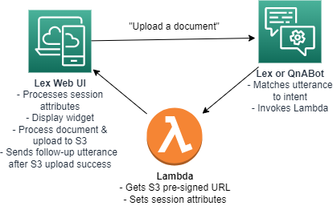
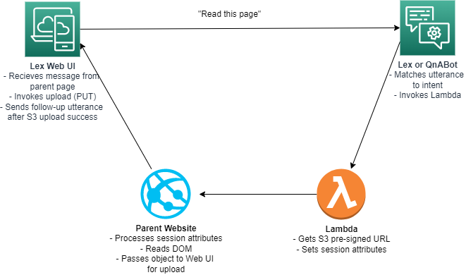

# Uploading Documents or reading the current page

This feature allows users to upload documents to an S3 bucket using a presigned URL and upload the content to S3 using the same mechanism. Lex Web UI expects a specific format to exist on the session attributes of the response, which must be set up through. The lambda necessary to generate presigned URLs does not come packaged with Lex Web UI and must be created within your own bot logic - please refer to the [AWS documentation on using presigned URLs](https://docs.aws.amazon.com/AmazonS3/latest/userguide/using-presigned-url.html) for details.


## Uploading a document using Lex Web UI

Lex Web UI uses a POST method to upload the data to S3, allowing dynamic file names and file types. To generate an appropriate presigned URL, use the presigned POST command. 



To enable Lex Web UI to generate an upload widget, Lex must return a session attribute object named 'upload' with the following parameters:

**preSignedURL**: The URL returned by the presigned post command

**postFields**: Field data (includes credentials and policy information) returned by the presigned post command

**uploadUtterance**: This is the utterance that will be sent back to the bot upon completion of the upload process. This allows the bot to execute logic against the newly uploaded document.

**type**: For file upload, use 'File'


Example upload object: 

```
'upload': {
      preSignedUrl: "https://s3.us-east-1.amazonaws.com/example-bucket",
      postFields: {
          "bucket": "example-bucket",
          "X-Amz-Algorithm": "XXXXXXXXXXXXXXX",
          "X-Amz-Credential": "XXXXXXXXXXXXXXXXXXXXXX",
          "X-Amz-Date": "XXXXXXXXXX",
          etc
         } ,
      uploadUtterance: "Now that the document is upload, do something with it",
      type: "File"
    }
```

Example Lambda to generate upload object (Node.js 18.x):

```
const client = new S3Client({ region: "us-east-1" });
const Bucket = "example-bucket";
const Key = "uploads/${filename}";

const { url, fields } = await createPresignedPost(client, {
    Bucket,
    Key,
    Conditions: [
        ["content-length-range", 0, 10 * 1024 * 1024],
        ["starts-with", "$Content-Type", "text/"]
    ],
    Expires: 60 
});

event['res']['session'] = {
    'upload': {
        preSignedUrl: url,
        postFields: fields,
        uploadUtterance: "Document uploaded successfully",
        type: "File"
    }
}
```

## Reading the parent page and uploading to S3 using Lex Web UI

Reading a parent page only works in the context of Lex Web UI operating in an iframe embedded on another webpage. The goal is to read what's on the webpage and send it to Lex Web UI for uploading to S3. Lex Web UI uses a PUT method to upload the parent page DOM to S3 as a text file. To generate an appropriate presigned URL, use the presigned PUT command. 



To enable Lex Web UI to read the page, Lex must return a session attribute object named 'upload' with the following parameters:

**preSignedURL**: The URL returned by the presigned PUT command

**uploadUtterance**: This is the utterance that will be sent back to the bot upon completion of the upload process. This allows the bot to execute logic against the newly uploaded document.

**type**: For reading a page, use 'Page'

Example upload object: 

```
'upload': {
      preSignedUrl: "https://s3.us-east-1.amazonaws.com/example-bucket/6720758.txt?AWSAccessKeyId=xxxxx",
      uploadUtterance: "Now that the page has been read and uploaded, do something with it",
      type: "Page"
    }
```

Example Lambda to generate upload object (Node.js 18.x):

```
 const s3Params = {
    Bucket: "example-bucket",
    Key: "example-file.txt",
    Expires: 30,
    ContentType: 'text/plain;charset=UTF-8',
  }

const uploadURL = await s3.getSignedUrl('putObject', s3Params)

event['res']['session'] = {
    'upload': {
      preSignedUrl: uploadURL,
      uploadUtterance: "Page read and uploaded successfully",
      type: "Page"
    }
  }
```

Example of how to send DOM data back to Lex Web UI from the parent page when the upload object is present on session attributes. This example is available on the default deployed parent.html page of Lex Web UI:

```
if(sessionAttributes.upload)
{
    var upload = JSON.parse(sessionAttributes.upload);
    
    if (upload.type == "Page") {
        var pageContent = document.documentElement.innerHTML;
        return Promise.resolve()
        .then(function () {
            return iframeLoader.api.sendParentContent(pageContent);
        })
        .then(function () { console.log('message succesfully sent'); })
        .catch(function (err) { console.error('error sending message ', err); });
    }
}
```

## Restricting file types

File types can be filtered by adding a configuration property called 'uploadMimeTypes' to the 'ui' section of the config file and providing a comma seperated list of MIME types as shown below. If this value is not present file types will be set as '*/*'.

**Note**: This does not prevent a user from uploading a specific file type to your S3 bucket. Restricting what kind of files that S3 will accept can be done in the presigned POST command in the Lambda function (see example code above).

The following configuration filters the uploads to only show CSV and text files.

```
"ui": {
    ...
    "uploadMimeTypes": "text/csv, text/plain",
    ...
}
```